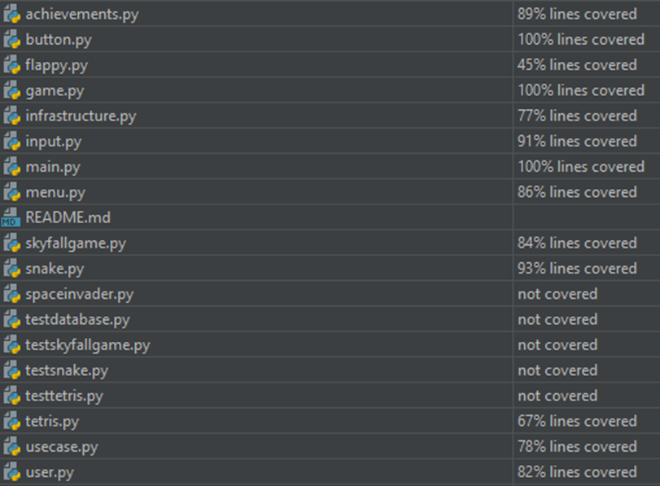

# Game Collection

## Einleitung

Im Rahmen der Vorlesung „Advanced Software Engineering“ haben H. H. und T. W. gemeinsam eine Spielesammlung programmiert und mit den in der Vorlesung vorgestellten Konzepten und Prinzipien nach und nach verbessert. Die Spielesammlung wurde in der Programmiersprache Python geschrieben. Dafür wurden unter anderem „Pygame“ und „Tinydb“ verwendet. In der Spielesammlung können sich mehrere Nutzer registrieren. Wenn Nutzer ein Spiel spielen, wird ihr Highscore ihrem Account zugeordnet. Damit Nutzer nur auf Accounts zugreifen können, die ihnen gehören, werden in der Datenbank Nutzername und Passwort gespeichert. Spieler haben derzeit die Auswahl zwischen vier verschiedenen Spielen.
1. „Skyfallgame“, einem Spiel in dem Spieler vom oberen Bildschirmrand herunterfallenden Gegnern ausweichen müssen.
2. „Tetris“, dem klassischen Puzzlespiel bei dem Reihen nach und nach lückenlos gefüllt werden müssen, um Punkte zu sammeln.
3. „Snake“, in dem Nutzer möglichst viel Nahrung sammeln müssen, ohne mit sich selbst oder dem Bildschirmrand zu kollidieren
4. „FlappyBird“, einem Jump-and-Run Spiel in dem Spieler Säulen ausweichen müssen.

Spieler können auch ihren Highscore, beziehungsweise die Highscores anderer Spieler einsehen und vergleichen. Über ein Optionsmenu können Spieler kleine Modifikationen an der Spielesammlung vornehmen.  
Die folgende schriftliche Ausarbeitung behandelt die verschiedenen Anpassungen und Ideen hinter dem Spiel, wie sie in der Vorlesung erarbeitet wurden.  
Im Refactoring Kapitel kann die verwendete Datei im jeweiligen Commit durch einen Klick auf das Bild aufgerufen werden.

## Installation und Quellcode

### Quellcode:

**[Dieses Repository](https://github.com/Heiko999/Gamecollection/tree/main)**

### Ausführung des Spiels

Das Spiel kann ausgeführt werden, indem das Projektrepository geklont wird. Der Code funktioniert in jeder gängigen IDE, die Pythonprogramme ausführen kann. Empfohlen wird jedoch Py Charm oder VSCode. Das Programm ist mit Python 3 ausführbar, die Versionen 3.8, 3.9 oder 3.10 werden dabei empfohlen. Andere Versionen sollten jedoch auch funktionieren. Das Programm wird mit der „main.py“ gestartet. Diese muss entweder in einer IDE oder mit Python ausgeführt werden.

### Benötigte Bibliotheken

Sind die Bibliotheken Pygame und TinyDB nicht installiert, müssen diese noch installiert werden. Dafür werden die folgenden zwei Befehle verwendet:  
•	„pip install pygame“  
•	„pip install tinydb“  
In den meisten IDEs ist es jedoch auch möglich, die Bibliotheken über einen Rechtsklick auf das Importstatement im Code zu installieren.

## Entwurfsmuster
Dieser Teil der Dokumentation befasst sich mit den verschiedenen Entwurfsmustern, die in diesem Projekt angewandt wurden. Entwurfsmuster sind „Softwarevorlagen“, welche verwendet werden können, um bekannte Entwurfsprobleme in der Softwareentwicklung zu lösen. 
### Singleton
Das erste eingesetzte Entwurfsmuster ist ein Singleton. Der Singleton gehört zu den Erzeugungsmustern. Erzeugungsmuster dienen der Erzeugung von Objekten, wobei die Erzeugung gekapselt und ausgelagert wird, um somit den Kontext der Objekterzeugung unabhängig von der Implementierung zu halten. Das Singleton stellt sicher, dass jeweils nur eine Instanz einer Klasse existiert und diese Instanz auch global verfügbar ist. In diesem Projekt wurde das Singleton Entwurfsmuster dazu verwendet, die Datenbankverbindung zu erzeugen und zu verwalten. Dadurch wird eine mehrfache Erzeugung von Verbindungen verhindert und somit Ressourcen wie beispielsweise Prozessorzeit und Leistung gespart.  
Bei der Verwendung von Singletons kann es jedoch auch zu neuen Problemen kommen. Dies ist insbesondere bei Programmen mit mehreren Threads der Fall. Es ist möglich, dass mehrere Threads gleichzeitig versuchen, auf den Singleton zugreifen. In diesem Fall kommt es zu einer Race-Conditions und somit unter Umständen zu einer Inkonsistenz der gespeicherten Daten. Dies ist möglich, wenn die Instanzvariable nicht gesetzt wurde, bevor ein weiterer Thread auf die Methode zugreift. In diesem Programm wird jedoch lediglich ein Thread genutzt, dementsprechend kann dieses Problem nicht auftreten, wodurch eine Singletonimplementierung für den Datenbankzugriff eine geeignete Lösung ist.  

```python
class DatabaseConnection:
    __instance = None
    db = None

    @staticmethod
    def get_instance():
        if DatabaseConnection.__instance is None:
            DatabaseConnection()
        return DatabaseConnection.__instance

    def __init__(self):
        if DatabaseConnection.__instance is not None:
            raise Exception("DatabaseConnection is a Singleton!")
        else:
            DatabaseConnection.__instance = self
            self.db = TinyDB('users.json')
```

Dies ist der Code der Datenbankverbindung. Gibt es bereits eine Instanz wird ein Fehler ausgegeben, ansonsten wird eine Verbindung hergestellt.


Das UML-Diagramm zeigt den Aufbau der Klasse „DatabaseConnection“.

### Strategy
Das zweite im Programm verwendete Entwurfsmuster heißt Strategy. Dieses Entwurfsmuster gehört zu den Verhaltensmustern. Diese erhöhen die Verhaltensflexibilität der Software zur Laufzeit. Strategy erlaubt beispielsweise die Auswahl verschiedener Algorithmen und Funktionen während das Programm läuft. In Rahmen des Projektes wurde dieses Entwurfsmuster im Minispiel „Skyfallgame“ implementiert, damit die Schwierigkeitsstufe zur Laufzeit angepasst werden kann.

```python
class Context:
    def __init__(self, strategy):
        self.strategy = strategy

    def setStrategy(self, strategy):
        self.strategy = strategy

    def executeStrategy(self):
        return self.strategy.execute()

class EnemyMode(ABC):
    @abstractclassmethod
    def execute(self):
        pass

#Defining the fast enemy mode
class FastEnemyMode(EnemyMode):
    def execute(self):
        Enemy.speedscale = 6

#Defining the slow enemy mode
class SlowEnemyMode(EnemyMode):
    def execute(self):
        Enemy.speedscale = 1
```

Der Code zeigt eine abstrakte Strategieklasse namens „EnemyMode“. In ihr wird die Methode „execute“ definiert. In den konkreten Strategieklassen für schnelle oder langsame Angreifer wird diese Methode implementiert und verändert. Die Klasse „SkyfallGame“ kann die verschiedenen Strategieklassen nutzen, indem eine Instanz der Klasse „Context“ erzeugt wird.  
Mittels der Funktion „setStrategy()“ kann eine konkrete Geschwindigkeit eingestellt werden. Mittels der „executeStrategy()“ kann die gewünschte Strategie verwendet und die Geschwindigkeit der Gegner angepasst werden.  
Ein Nachteil des Strategie Entwurfsmusters ist, dass der Code dadurch komplexer wird. Es wird eine weitere Abstraktionsschicht benötigt, um die Implementierungen zu verwalten. Für eine bessere Verwaltbarkeit und Skalierbarkeit der Anwendung ist diese zusätzliche Komplexität jedoch notwendig. Außerdem können mithilfe dieser Abstraktion ohne großen Aufwand weitere Schwierigkeiten in das Spiel eingebaut werden, indem die „speedscale“ Variable einen anderen Wert erhält. Eine Implementierung anderer Funktionen ist ebenfalls denkbar.


Im UML-Diagramm des Spiels ist das Entwurfsmuster Strategy zu erkennen.  

## Unittests der Datenbank + Mocking
Im Programm werden verschiedene Use Cases getestet. Zu diesem Use Cases gehören unter anderem:
- Die korrekte Registrierung eines Spielers
- Eine fehlerhafte Registrierung eines Spielers
- Registrierung eines Spielers ohne Passwort
- Registrierung eines Spielers ohne Namen
- Können Spieler, die sich einloggen wollen, in der Datenbank gefunden werden
- Können falsche Passwörter im Anmeldevorgang erkannt werden
- Können Spieler aus der Datenbank gelöscht werden

Dafür wurden Python Module für Unittests und Mocks verwendet. Die Tests erfolgen, indem ein Mockobjekt in der Datenbank erzeugt wird.

```python
def test_register_success(self):
    mock_user_repository = Mock(spec=UserRepositoryImpl)
    use_case = RegistrationUseCase(mock_user_repository)
```

Anschließend wurden zu testende Mockuser in diese eingefügt und Mockmethoden benutzt, um die erhaltenen Ergebnisse der Suche mit dem Erwartungswert zu vergleichen. Somit wird auch sichergestellt, dass die Tests repeatable sind. Da Mocks genutzt werden, können die Tests beliebig oft durchgeführt werden, ohne dass sich die realen Daten in der Datenbank ändern.  
Des Weiteren wurden mehrere Unittests erstellt, um die wichtigsten Funktionen der verschiedenen Spiele zu testen.  

### Snake
Bei den Unittests für das Spiel „Snake“, werden verschiedene Bewegungen getestet. Zunächst wird die Position der Schlange vor einem Tastendruck erfasst. Nachdem die Taste gedrückt wurde, wird die neue Position ebenfalls erfasst und mit der alten Position verglichen. Um zu überprüfen, ob die Richtung korrekt ist, wird im Richtungsvektor betrachtet, ob eine positive oder eine negative X beziehungsweise Y Koordinate gespeichert wird.  

```python
class TestGame(unittest.TestCase):

    def test_snake_moveright(self):
        game = SnakeGame()
        initial_position = game.snake.rect.center
        event = Mock(type=pg.KEYDOWN, unicode='', key=pg.K_RIGHT)
        game.snake.control(event)
        game.snake.update()
        updated_position = game.snake.rect.center
        updated_direction = game.snake.direction
        self.assertNotEqual(initial_position, updated_position)
        self.assertEqual(updated_direction, (50, 0))  # Check if direction changed to right
```

### Skyfall
Im Spiel „Skyfall“ werden die Kollisionen getestet. Zunächst wird überprüft, ob die „game_over“ Variable zu Spielbeginn noch nicht gesetzt ist. Anschließend wird ein Objekt der Klasse Player auf eine Position gesetzt, auf der bereits ein Gegner steht. Somit kommt es zu einer Kollision zwischen Player und Enemy. Über die Updatefunktion wird diese Kollision geprüft. Im Anschluss wird betrachtet, ob das Spiel, wie erwartet, in den Zustand „game_over“ wechselt.  

```python
class TestPlayer(unittest.TestCase):
    def setUp(self):
        self.game = skyfallGame()
        
    def test_collision_detection(self):
        self.assertFalse(self.game.game_over)
        self.game.player.rect.centerx = self.game.enemy_sprites.sprites()[0].rect.centerx
        self.game.player.rect.centery = self.game.enemy_sprites.sprites()[0].rect.centery
        self.game.collision_score_update()
        self.assertTrue(self.game.game_over)
```

## ATRIP
### Automatic:
Die Tests benötigen keine Aktion eines Menschen. Dafür wurde ein GitHub Actions Workflow erstellt, der die Tests automatisch ausführt, sobald neue Änderungen ge-pusht werden. Sollte einer der Tests fehlschlagen wird der Fehler umgehend ge-meldet.

### Thorough:
Um alle Funktionalitäten gründlich zu testen, wurden viele verschiedene Use Cases erstellt. Ein Beispiel dafür sind die Unittests der Datenbank. Dort werden die wichtigen Funktionen „login“, „signin“, „delete“ getestet, damit alle Kernfunktionalitäten funktionieren. Hierbei gibt es noch Unterscheidungen wie beispielsweise ungültige und gültige Anmeldeinformationen.

### Repeatable:
Die Tests können jederzeit und beliebig oft durchgeführt werden. Für die Tests der Datenbank wurde deswegen ein Mockobjekt verwendet. Mithilfe des Mockobjekts können Tests durchgeführt werden, ohne Daten der Produktivdatenbank zu verändern.

### Independent:
Alle Tests können unabhängig voneinander und in beliebiger Reihenfolge ausgeführt werden. Da für die Datenbanktests Mockobjekte benutzt wurden, ist es egal, in welcher Reihenfolge sie ausgeführt werden, da sie keinen Einfluss auf die reale Datenbank haben.

### Professional:
Da jede Methode eines Tests nur eine Funktion testet, sind die Tests leicht zu verstehen. Dies macht die Tests außerdem übersichtlicher, wodurch eine Einarbeitung in die Funktionalität erleichtert wird.

## Code Coverage:
Um schwerwiegende Fehler zu vermeiden, sollte möglichst viel Code getestet werden, da Bugs so schnell entdeckt werden können. Dabei sind jedoch nicht alle Klassen gleich wichtig. Für die Spielesammlung war insbesondere die Funktionalität der Datenbank wichtig. Somit war es vor allem wichtig, die Dateien „Infrastructure.py“, „UseCase.py“ und „user.py“ zu testen. In den Dateien, die keine Spiele beinhalten liegt die reale Testquote dabei bei 100% der Funktionalität, wobei für „infrastructure.py“ ein falscher Wert angezeigt wird, da durch das Nutzen von Mocks in den Datenbanktests teilweise Werte vorgegeben werden, da mit einem Mock Objekt der Datenbank gearbeitet wird. Mit acht Tests sind diese Dateien jedoch genügend abgedeckt. Bei den Spielen wird die Grundfunktionalität getestet, einige Extras sind also nicht in den Tests abgedeckt. Im Schnitt wird eine Abdeckung von 84% des Codes der Klassen erreicht, dabei ist jedoch zu beachten, dass die Anzahl der Codezeilen zwischen den verschiedenen Klassen schwankt, die 84% geben also nicht den absoluten Anteil der abgedeckten Zeilen an.



## Programming Principles

### SOLID:

#### Single Responsibility:
Ein Beispiel für die „Single Responsibility“ ist das Modul Snake. Das Spiel hätte in einer einzigen großen Klasse implementiert werden können. Stattdessen wurde es jedoch in die drei Klassen „SnakeGame“, „Snake“ und „Item“ aufgeteilt. Jede einzelne Klasse ist für eine andere Funktion des Spiels zuständig.

#### Open / Closed Prinzip:
Nach dem Open - Close Prinzip soll eine Klasse für Veränderung offen, aber für Modifikation geschlossen sein. Dementsprechend sollte eine Klasse erweitert werden können, ohne bestehende Funktionen bzw. Code umzuschreiben. Im Programm wurde dieses Konzept an verschiedenen Stellen beispielsweise durch Vererbung oder abstrakte Klassen implementiert. 
Ein Beispiel dafür ist die im Entwurfsmuster „Strategy“ besprochene Enemy Klasse des Skyfall Spiels. Durch das „Strategy“ Muster, können neue Schwierigkeitsgerade erstellt werden, ohne den bereits geschriebenen Code zu ändern. Es wird lediglich eine weitere Implementierung des Interfaces EnemyMode erstellt.

#### Liskov-Substitutions Prinzip:
Nach dem Liskov-Substitutions Prinzip sollen Objekte einer Superklasse problemlos mit Objekten ihrer Subklasse ausgetauscht werden können. Ein Beispiel hierfür ist die Superklasse „Food“ im Spiel Snake und ihre Subklassen Item1, Item2 und Item3. Jede dieser Klassen erbt von der Klasse Food und fügt ihr spezielle Eigenschaften, wie beispielsweise die Punkte, die das Essen geben soll, oder die Farbe hinzu. Die Methode „new_foodtype“ der Klasse „SnakeGame“, kann verschiedene Instanzen der Subklassen erzeugen und sie in der Variable „self.food“ speichern. Dabei ist es egal, welche Subklasse in dieser Variable gespeichert wird, da alle die „Draw“ Methode der Superklasse Food benutzen können.

#### Interface Segregation:
Ein Beispiel für die Interface Segregation kann Modul Achievements gefunden werden.
In diesem Modul sind Klassen, die nach verschiedenen Errungenschaften Aktionen triggern.
Hat ein Spieler beispielsweise seinen eigenen Highscore übertroffen, gibt die Klasse „points_reached“ einen Gratulationstext auf der Konsole aus. Hat der Spieler stattdessen den aktuellen Highscore des Spiel gebrochen, wird die Klasse „highscore_reached“ genutzt, um eine Siegesmelodie abzuspielen. Beide Klassen erben von der Klasse Achievements. Damit die Klasse „points_reached“ jedoch nicht unnötigerweise die Funktion „music_play()“ erbt, wurde eine abstrakte Klasse namens „bigger_archivements“ implementiert. Diese erbt ebenfalls von der Klasse Achievements. Anschließend kann die Klasse „highscore_reached“ über das Interface „bigger_achievement“ die Methode „music_play()“ erben. Außerdem erbt sie von der Klasse „achievement“ die Methode „congrats()“.


#### Dependency-Inversion:  
Die Dependency-Inversion besagt, dass ein High-Level Modul nicht direkt von Low-Level Modulen abhängig sein sollte. Es solle stattdessen von einer Abstraktion abhängig sein. Im Programm ist deswegen eine Dependency-Inversion bei den Use Cases und dem User Repository implementiert worden. Alle Use Cases sind von einem einzigen Repository abhängig. 

```python
class RegistrationUseCase:
    def __init__(self, user_repository):
        self.user_repository = user_repository
```

Das User Repository ist dabei lediglich ein Interface und wird in der konkreten Klasse UserRepositoryImpl implementiert. Durch eine Dependency-Injection wird das Repository in den Use Case injected. Es könnte jedoch auch jede andere Implementierung des Repository Interfaces benutzt werden.

```python
def new_check_signin(self):
    self.signin_button.draw(self.screen)
    if self.signin_button.click():
        user_repo = UserRepositoryImpl()
        registration_use_case = RegistrationUseCase(user_repo)
```

### DRY:
DRY, kurz für „Don´t Repeat Yourself“, bedeutet, dass Code möglichst nur ein einziges Mal geschrieben werden soll. Jede Wiederholung erhöht das Risiko für Fehler und sorgt für einen höheren Änderungsaufwand. Im Programm wurde bei der Ausgabe der Flappy Bird Highscores für jeden einzelnen Eintrag dieselbe Reihenfolge an Operationen durchgeführt. Dieser Highscore konnte jedoch auch mittels einer Schleife mit durchlaufender Zählvariable ausgegeben werden. Somit konnten mehrere Zeilen Code eingespart werden. Sollte eine Änderung der Methode notwendig sein muss diese Änderung nun auch nur für eine Implementierung durchgeführt werden, statt wie bisher für fünf verschiedene.  
Der Code zeigt die alte Version mit Wiederholungen  

```python
def draw_display(self):
    self.display.fill(self.game.backgroundcolor)
    self.draw_text('Highscores FlappyBird:', 20, self.game.DISPLAY_W / 2, self.game.DISPLAY_H / 2 - 30)
    #shows the highscore list in increments of 5 players
    if 1 + self.n <= self.leng:
        self.draw_text(str(self.flapscore[0 + self.n]).replace("(", "").replace("'", "").replace(",", " -").replace(")", ""), 15, self.mid_w, self.mid_h + 20)
    if 2 + self.n <= self.leng:
        self.draw_text(str(self.flapscore[1 + self.n]).replace("(", "").replace("'", "").replace(",", " -").replace(")", ""), 15, self.mid_w, self.mid_h + 40)
    if 3 + self.n <= self.leng:
        self.draw_text(str(self.flapscore[2 + self.n]).replace("(", "").replace("'", "").replace(",", " -").replace(")", ""), 15, self.mid_w, self.mid_h + 60)
    if 4 + self.n <= self.leng:
        self.draw_text(str(self.flapscore[3 + self.n]).replace("(", "").replace("'", "").replace(",", " -").replace(")", ""), 15, self.mid_w, self.mid_h + 80)
    if 5 + self.n <= self.leng:
        self.draw_text(str(self.flapscore[4 + self.n]).replace("(", "").replace("'", "").replace(",", " -").replace(")", ""), 15, self.mid_w, self.mid_h + 100)
    self.blit_screen()

```

Der überarbeitete Code ohne Wiederholungen

```python
def draw_display(self):
        self.display.fill(self.game.backgroundcolor)
        self.draw_text('Highscores FlappyBird:', 20, self.game.DISPLAY_W / 2, self.game.DISPLAY_H / 2 - 30)
        #shows the highscore list in increments of 5 players
        for i in range(5):
            if i + 1 + self.n <= self.leng:
                self.draw_text(str(self.flapscore[i + self.n]).replace("(", "").replace("'", "").replace(",", " -").replace(")", ""), 15, self.mid_w, self.mid_h + 20 + (i * 20))
        self.blit_screen()
```

## GRASP:
### High-Cohesion:
High-Cohesion bedeutet in der Softwareentwicklung, dass alle Elemente eines Moduls miteinander in Verbindung stehen und einen gemeinsamen Zweck oder eine gemeinsame Funktion erfüllen sollten. Im Programm wurde dieses Prinzip umgesetzt, indem jede Funktionalität in ein Modul ausgelagert wurde. Ein Beispiel hierfür ist das Snake Modul. Dieses ist für das Spiel Snake zuständig. Es besteht aus mehreren Klassen, welche alle zusammenarbeiten, um die Funktionalität des Spiels zu ermöglichen. 
### Low-Coupling:
Das Low-Coupling Prinzip besagt, dass einzelne Module so unabhängig voneinander sein sollten, wie möglich. Im Programm ist dies beispielsweise bei den Spielen der Fall. Jedes Spiel wird in einem eigenen Modul implementiert, dessen Abhängigkeiten und Logik sich auf die Klassen innerhalb dieses Moduls beschränken. Die Spiele müssen lediglich ihren Highscore in einer Highscore Variablen speichern, damit diese für die Datenbankeinträge ausgelesen werden können. Somit lassen sich Spiele sehr einfach löschen oder hinzufügen, da lediglich ein neues Attribut mit dem Spielnamen im User Objekt hinzugefügt werden und im Menu ein Button für das neue Spiel erstellt werden muss, beziehungsweise ein alter Button und ein altes Attribut entfernt werden müssen.

## Code Smells und Refactoring:
### Codesmell: Comments 
Ein Code Smell ist ein mehrfach verwendeter Kommentar, der erklärt, dass ein darauffolgender Codeblock den Text eines Menus zeichnet.

```python
def display_menu(self):
    self.run_display = True
    while self.run_display:
        self.check_events()
        self.check_input()
        # draw the MenuText on the screen
        self.display.fill(self.game.backgroundcolor)
        self.draw_text('GameCollection', 20, self.game.DISPLAY_W / 2, self.game.DISPLAY_H / 2 - 30)
        self.draw_text("SpaceInvaders", 15, self.spacex, self.spacey)
        self.draw_text("Tetris", 15, self.tetrisx, self.tetrisy)
        self.draw_text("Snake", 15, self.snakex, self.snakey)
        self.draw_text("Flappy Bird", 15, self.flapx, self.flapy)
        self.draw_cursor()
        self.blit_screen()

```

### Refactoring Methode: Extract Method (Commit: 5495ff7)
Um diesen Code Smell zu beseitigen, wurde die Refactoring Methode „Extract Method“ benutzt. Dafür wird der zusammenhängende Code in die Funktion „draw_display()“ ausgelagert. Dadurch erklärt der Methodenname den Zweck des folgenden Codes und der Kommentar wird überflüssig. Außerdem wird die Lesbarkeit und Verständlichkeit des Codes verbessert, da nun leicht zu erkennen ist, dass die Methode „display_menu()“ zunächst die Events und danach die Inputs überprüft um im Anschluss das Menu zu zeichnen.

```python
def display_menu(self):
    self.run_display = True
    while self.run_display:
        self.check_events()
        self.check_input()
        self.draw_display()

def draw_display(self):
    self.display.fill(self.game.backgroundcolor)
    self.draw_text('GameCollection', 20, self.game.DISPLAY_W / 2, self.game.DISPLAY_H / 2 - 30)
    self.draw_text("SpaceInvaders", 15, self.spacex, self.spacey)
    self.draw_text("Tetris", 15, self.tetrisx, self.tetrisy)
    self.draw_text("Snake", 15, self.snakex, self.snakey)
    self.draw_text("Flappy Bird", 15, self.flapx, self.flapy)
    self.draw_cursor()
    self.blit_screen()

```

### Codesmell: Long Method
Im Spiel Flappy ist die Methode „game()“, welche für den logischen Ablauf des Spiels zuständig ist, viel zu lang. Hier können viele verschiedene Teile der ursprünglichen Methode in eigene Methoden wie beispielsweise „createPipe()“, für die Erstellung von Röhren, oder „isGameOver()“, zur Überprüfung von Kollisionen, ausgelagert werden. Des Weiteren können der Vogel und die Pipes extrahiert und als eigene Klassen implementiert werden, wodurch das Spiel objektorientierter wird. Zum Einsatz kämen hierbei verschiedene Refactoring Methoden, wie die „Extract Method“ und „Extract Class“ Methoden.

### Refactoring Methode: Extract Variable (Commit: 2cd9161)
Die draw_Display() Methoden der Highscore Menu profitieren zwar von der Umsetzung des DRY Prinzips, sind jedoch weiterhin sehr lang und unübersichtlich. Als Beispiel kann das Menu für Flappy Bird betrachtet werden. Um den Inhalt des JSON-Datei übersichtlich anzuzeigen, muss der String zunächst bearbeitet werden.

```python
def draw_display(self):
        self.display.fill(self.game.backgroundcolor)
        self.draw_text('Highscores FlappyBird:', 20, self.game.DISPLAY_W / 2, self.game.DISPLAY_H / 2 - 30)
        #shows the highscore list in increments of 5 players
        for i in range(5):
            if i + 1 + self.n <= self.leng:
                self.draw_text(str(self.flapscore[i + self.n]).replace("(", "").replace("'", "").replace(",", " -").replace(")", ""), 15, self.mid_w, self.mid_h + 20 + (i * 20))
        self.blit_screen()
```

Flapscore ist ein Dictionary, in dem die Spielernamen und die dazugehörigen Highscores zu finden sind. Durch diese Dictionary iteriert die Funktion, um alle Highscores anzeigen zu können. Das jeweilige Tupel muss in einen String umgewandelt werden, anschließend wird der String Mithilfe der Methode „replace“ formatiert. Diese Formatierung wird in eine temporäre Variable ausgelagert, wodurch die Methode übersichtlicher und verständlicher wird.

```python
    def draw_display(self):
        self.display.fill(self.game.backgroundcolor)
        self.draw_text('Highscores FlappyBird:', 20, self.game.DISPLAY_W / 2, self.game.DISPLAY_H / 2 - 30)
        #shows the highscore list in increments of 5 players
        for i in range(5):
            if i + 1 + self.n <= self.leng:
                flapscore_formatted = str(self.flapscore[i + self.n]).replace("(", "").replace("'", "").replace(",", " -").replace(")", "")
                self.draw_text(flapscore_formatted, 15, self.mid_w, self.mid_h + 20 + (i * 20))
        self.blit_screen()
```

### Code Smell: Data Class
Eine Data Class ist eine Klasse im Code, welche lediglich aus Attributen, Gettern und Settern besteht. Diese Klassen besitzen keine weiteren Funktionen und können die Daten nicht selbstständig bearbeiten. In der Spielesammlung ist die Klasse „User“ ein Beispiel für eine Data Class.

```python
class User:
    def __init__(self, name, password, tetris, spaceinvader, snake, flappy):
        self.name = name
        self.password = password
        self.tetris = tetris
        self.spaceinvader = spaceinvader
        self.snake = snake
        self.flappy = flappy

    def get_name(self):
        return self.name

    def get_password(self):
        return self.password
    
    def get_tetris(self):
        return self.tetris
    
    def get_spaceinvader(self):
        return self.spaceinvader
    
    def get_snake(self):
        return self.snake
    
    def get_flappy(self):
        return self.flappy
    
    def set_tetris(self, score):
        self.tetris = score
    
    def set_spaceinvader(self,score):
        self.spaceinvader = score
    
    def set_snake(self,score):
        self.snake = score
    
    def set_flappy(self,score):
        self.flappy = score
```

Diese wird genutzt, um die Benutzer aus der Datenbank abzubilden. Die Klasse „User“ wird in der Klasse „UserRepository“ verwendet, um dort weiter verarbeitet zu werden. Es wäre auch möglich, diese beiden Klassen in einer Klasse zu kombinieren, wodurch der Code Smell beseitigt werden würde. Da in diesem Fall jedoch mehrere Argumente für die verwendung einer Data Class sprechen, wurde dieser Teil des Codes nicht refactored. Die Data Class ist für die Einhaltung des Single Responsibility Principles von großer Bedeutung. Die Klasse „User“ ist für die Repräsentation der Benutzer zuständig, die Klasse „UserRepositoryImpl“ hingegen für den Datenbankzugriff. Dadurch ist der Code leichter zu verstehen. Außerdem kann die Datenbankimplementierung so leichter ausgetauscht werden. Derzeit definiert das „Userrepository“ Interface lediglich die UserRepositoryImpl Klasse. Würde jedoch eine weitere Implementierung einer anderen Datenbank hinzugefügt werden, müssten in dieser Implementierung auch die Userattribute etc. definiert werden. Im Falle einer kombinierten Klasse aus den Klassen „User“ und „UserRepositoryImpl“ würden somit unnötig lange Klassen entstehen. Der Code Smell Data Class ist also in diesem Fall das geringere Übel und bleibt somit bestehen.  

## Clean-Architecture:
Insbesondere für Datenbankzugriffe war die korrekte Implementierung einer Clean-Architecture enorm wichtig. Die hierfür verwendeten Schichten sind die Domain, die Application und die Adapter Ebene. Es sollte eine einheitliche Klasse für Zugriffe auf die Datenbanken existieren sowie genau definierte Use Cases, um den Datenbankenzugriff übersichtlich und verständlich zu halten.   

Auf der Domainebene wurde hierfür die Entität „User“ erstellt. Diese Klasse erstellt ein Datenbankobjekt, welches den Namen und das Passwort eines Spielers, sowie dessen Highscores in jedem Spiel enthält. Außerdem sind Getter und Setter Methoden für diese Variablen implementiert worden.

```python
class User:
    def __init__(self, name, password, tetris, spaceinvader, snake, flappy):
        self.name = name
        self.password = password
        self.tetris = tetris
        self.spaceinvader = spaceinvader
        self.snake = snake
        self.flappy = flappy
```

Mit den Usern kann über ein Repository Interface agiert werden, wodurch die „User“ Entität von jeglichen Abhängigkeiten entkoppelt ist. 

```python
class UserRepository(ABC):
    @abstractmethod
    def save(self, user):
        pass

    @abstractmethod
    def find_by_name(self, name):
        pass

    @abstractmethod
    def check_password(self,name, password):
        pass

    @abstractmethod
    def delete_by_name(self, name):
        pass
    
    @abstractmethod
    def update(self, user):
        pass

    @abstractmethod
    def find_all(self):
        pass

    @abstractmethod
    def get_highest_score(self, game_name):
        pass
```

Auf der Applikationschicht wurde das Modul „Usecase“, welches verschiedene Use Cases, also die Applikationslogik enthält, erstellt. Die Use Cases beinhalten beispielsweise die Registrierung oder den Login. Diesen Use Cases wird eine Implementierung des Repository Interface übergeben, wodurch sie auf die Datenbank zugreifen können.

```python
class FindPlayerUseCase:
    def __init__(self, user_repository):
        self.user_repository = user_repository

    def execute(self, name):
        user = self.user_repository.find_by_name(name)
        if user:
            return True
        return False
```

Auf der Adapterschicht wird unteranderem das Modul Infrastruktur sowie die Datenbank implementiert. Die Adapterschicht wird für verschiedene externe Zugriffe, wie beispielsweise den Datenbankzugriff über das Infrastruktur Modul verwendet. Hierfür wird innerhalb des Infrastrukturmoduls, mit der RepositoryImpl Klasse, eine konkrete Implementierung für das Repository Interface geboten. Dieses hat nun direkten Zugriff auf die Datenbanken.

```python
class UserRepositoryImpl(UserRepository):
    def __init__(self):
        self.db = DatabaseConnection.get_instance().db
        self.table = self.db.table('users')

    def save(self, user):
        user_data = {'name': user.get_name(), 
                     'password': user.get_password(), 
                     'Tetris': user.get_tetris(),
                     'SpaceInvaders': user.get_spaceinvader(),
                     'Snake': user.get_snake(),
                     'Flappy': user.get_snake()}
        self.table.insert(user_data)

    def find_by_name(self, name):
        UserQuery = Query()
        result = self.table.search(UserQuery.name == name)
        if result:
            user_data = result[0]
            return User(user_data['name'], 
                        user_data['password'], 
                        user_data['Tetris'], 
                        user_data['SpaceInvaders'], 
                        user_data['Snake'], 
                        user_data['Flappy'])
        return None
    
    def check_password(self, name, password):
        user = self.find_by_name(name)
        if user and user.password == password:
            return True
        else:
            return False
        
    def delete_by_name(self, name):
        UserQuery = Query()
        self.table.remove(UserQuery.name == name)
```

Doch auch die Benutzeroberflächen befinden sich in dieser Schicht. Hierzu gehören unter anderem das Modul Menu, welche die GUIs für das Menü der Spielesammlung verwaltet, aber auch die Module für die einzelnen Spiele.